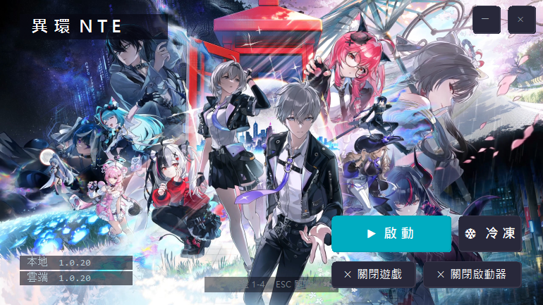
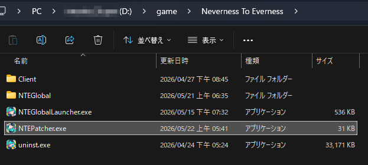
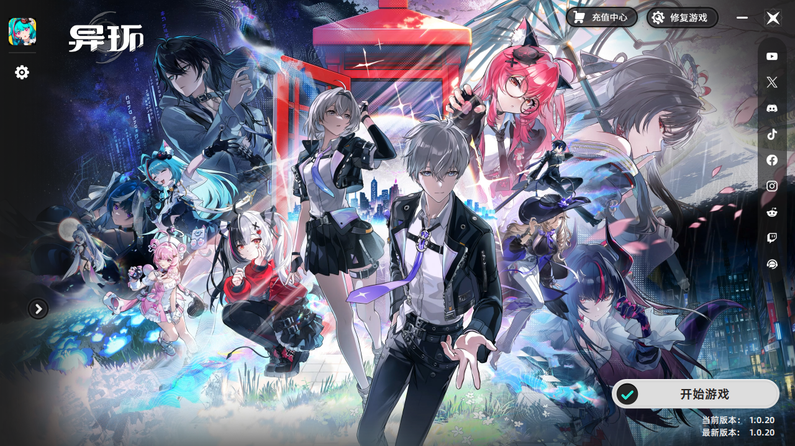
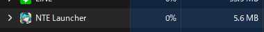

# 異環的各種工具

## NTELauncherRe

### 起因

`Neverness To Everness\NTEGlobal\ResFilesM\3000001\bgimgs` 中的 `yh.dat` 是一個 MJPEG 檔案，負責啟動器背景動圖，容量卻高達 `600　MB`。異環遊戲綁定啟動器，背景執行就高達 `800 MB 記憶體`：

[點此下載](https://github.com/owogametools/NTEToolsP/releases/latest/download/NTEGlobalGame.exe) 需放入遊戲根目錄中。

本工具會引導使用者對啟動器資源進行優化裁減。只消耗 20 MB RAM，可縮小到工作列。

可用鍵盤數字快速對應功能：

1 -> 啟動遊戲（會自動冷凍啟動器）
2 -> 冷凍
3 -> 關閉遊戲
4 -> 關閉官方啟動器
ESC -> 離開

### 操作流程

- 放本工具在遊戲根目錄。（可拖曳捷徑到桌面，但本體需要在遊戲目錄）

- 點選啟動
- 本工具會縮小至右下角工作列小圖標，並自動持續維持官方啟動器的記憶體優化。

- 如果很介意，也可以關閉本工具，但是會失去持續記憶體釋放功能。（一般來說也不會太高畢竟已經優化背景動圖）

## 原理流程簡介

- 使用 FFMPEG 裁切第一張圖，取代原有 yh.dat
- 啟動器會因為檔案不同而強制更新。換句話說，重啟啟動器時，需要原版的 yh.dat，然後才重新替換：
  1. 執行一開始會直接關閉啟動器（如果當前正在運行）
  2. 以 FFMPEG 裁切後，啟動啟動器，再還原。
  3. 如果是同個背景，會從上一次緩存結果直接使用。

- yh.dat 開服版本瘦身過的背景成品，如果你不想用任何腳本，就只想純手動就用這個成品。可直接覆蓋到 `Neverness To Everness\NTEGlobal\ResFilesM\3000001\bgimgs`，覆蓋前先把原版備份。
- 但常常會遇到強制更新，並不推薦這個方式。
- resize.ps1 是使用 ffmpeg 裁減原版 dat 的 powershell 腳本，放置於遊戲根目錄中（與 `NTEGlobal` 資料夾同級），會把原版重命名為 `yh.dat.bak`。
- restore.ps1 是把 `yh.dat.bak` 重命名為 `yh.dat` 的腳本。
- 上面這些是給手動黨用的，一般就使用 NTEPatcher 就可以了。歡迎提 issue。